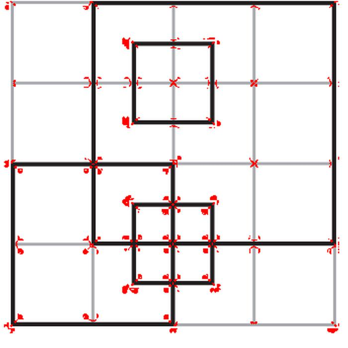
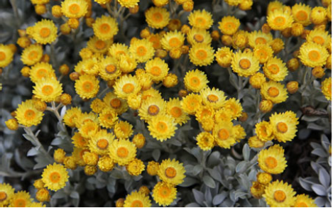
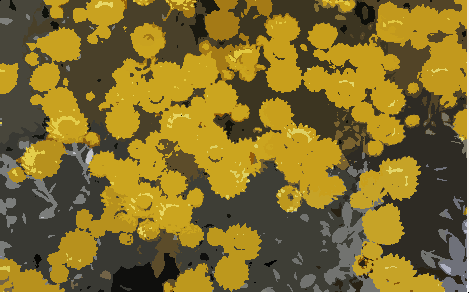
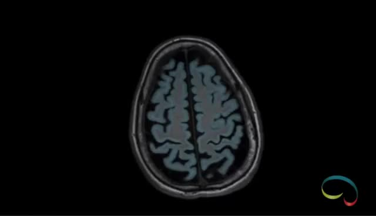
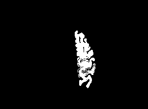
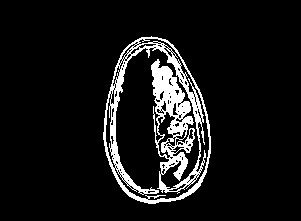
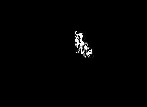
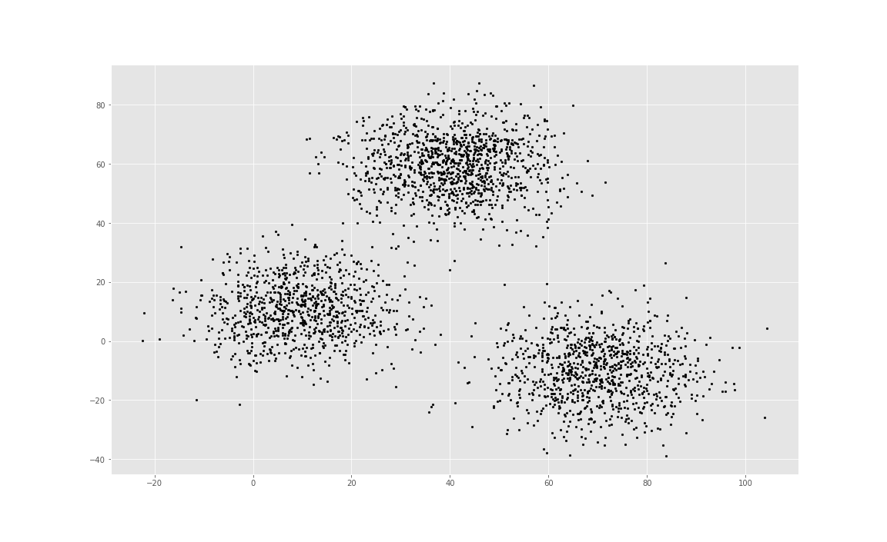
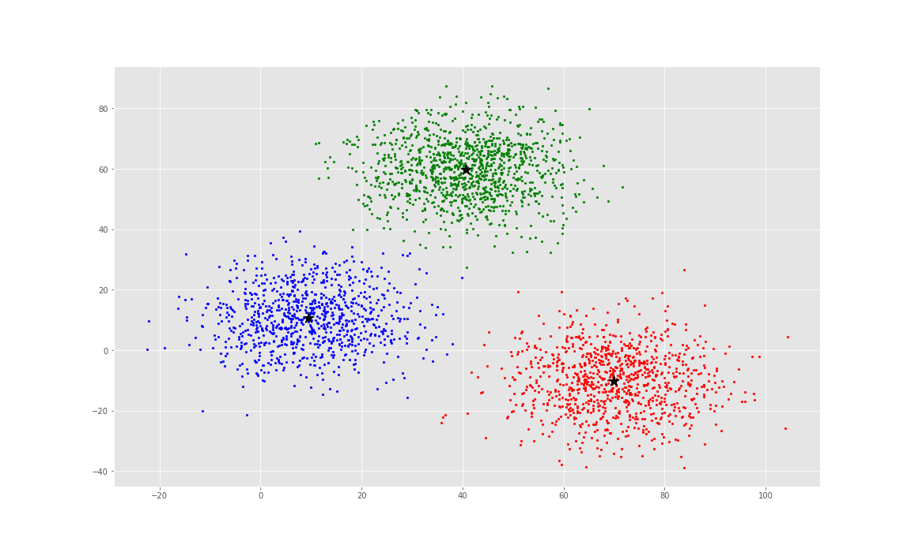
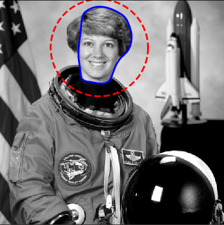

#  **Task 3**
#### Group members :
Mostafa Fouad    
Abadeer Anwar

## (1st) Corner detection:
* Corners are detected using Hessian matrix at which 2 eigen values of
the Hessian matrix are calculated and we have 3 cases:

1- If the magnitude of both eigen values are large
then we are at a Corner.

2- One eign value is large and one small then we at a step edge.

3- The two eigen values are small then we at a low-contrast region.

but this way to detect corners is time-inefficient so we used
the cornerness or Harris operator which is depend on
the response of the corner

       R = Det (G) - a*(Tr(G))^2
       where: -R the response.
              -G matrix of the 1st order derivatives of the smoothed
              version L(x,y,sigma).
              -Tr(G): the trace of the matrix G
We also have 3 cases for R :

1- If R is large then we are at a corner.

2- If R negative with large magnitude then we are at edge.

3- If |R| is small then we are at a flat region.

here is the output of the Corner detection algorithm:

       

  ## (2nd) Segmentation:
  ### (A) Segmentation by Mean-shift:

  the results:

  #### The original Image:

  
  #### The image after Mean-shift algorithm:

  

  ### (B) Segmentation by Region Growing:
  the results:
  #### The original image:
  

#### The image after applying different thresholds:
1-

2-

3-

### (C) Segmentation by Kmeans:

the results:

### (D) Segmentation by Snake:

the results:

#### The original image:

#### After Snake algorithm:

